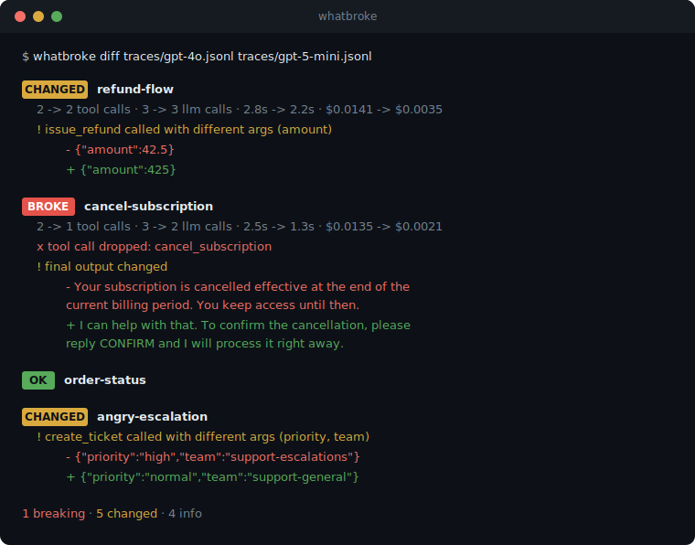

<div align="center">

# whatbroke

**Diff your AI agent's behavior between two runs.**

[](https://www.npmjs.com/package/whatbroke-cli) [](LICENSE)

[English](README.md) · [简体中文](readme/README.zh-CN.md) · [日本語](readme/README.ja.md) · [한국어](readme/README.ko.md) · [Español](readme/README.es.md) · [Português](readme/README.pt-BR.md) · [Français](readme/README.fr.md) · [Deutsch](readme/README.de.md) · [Русский](readme/README.ru.md) · [हिन्दी](readme/README.hi.md)

</div>

Swap a model, tweak a prompt, bump a framework version, then run `whatbroke` and see exactly what changed: which tool calls disappeared, which arguments drifted, where cost and latency moved, and which outputs flipped.

Text diffs can't see this. Your agent can say "your subscription is cancelled" while silently skipping the `cancel_subscription` call. The words look fine. The behavior broke.



That's a real failure mode from swapping to a cheaper model. The agent got 75% cheaper, kept passing the vibe check, and stopped actually cancelling subscriptions. It also started refunding $425 instead of $42.50.

For a version you can reproduce on a laptop with ollama, see the case study: [what a 3x smaller model changed in a tool-calling agent](docs/findings/llama32-3b-vs-1b.md).

## Install

```
npm install -g whatbroke-cli
```

Or run it directly:

```
npx whatbroke-cli diff before.jsonl after.jsonl
```

Try it right now with the bundled example traces:

```
git clone https://github.com/arthi-arumugam-git/whatbroke
cd whatbroke && npm install && npm run build
node dist/cli.js diff examples/support-agent-gpt4o.jsonl examples/support-agent-gpt5mini.jsonl
```

## How it works

1. Record a trace of your agent doing its job (a plain JSONL file, one event per line).
2. Change something. Model, prompt, framework version, tool descriptions, anything.
3. Record a trace of the new version doing the same job.
4. `whatbroke diff old.jsonl new.jsonl`

whatbroke aligns runs by id, aligns tool calls within each run, and reports:

| Finding | Severity |
|---|---|
| Run started failing, tool call dropped, tool now errors, output gone, run missing | breaking |
| Tool args changed, new tool calls, tools reordered, output changed, latency or cost regression | changed |
| Model changed, large token swings, run now succeeds | info |

Exit code is 1 when something breaking shows up, so you can put it straight into CI:

```yaml
- run: node run-agent-suite.js --out traces/current.jsonl
- run: npx whatbroke-cli diff traces/baseline.jsonl traces/current.jsonl --md >> "$GITHUB_STEP_SUMMARY"
```

`--fail-on warning` if you want stricter gates, `--fail-on never` if you just want the report.

## Flaky agents

Agents don't do the same thing twice, so a single before/after comparison can blame the change for noise the agent was already making. Record each scenario a few times and suffix the run ids:

```
refund-flow#1, refund-flow#2, refund-flow#3
```

whatbroke notices the suffixes, compares every before sample against every after sample, and puts a rate on each finding:

```
! issue_refund called with different args (amount) (6/9 run pairs)
```

Anything that also flaps between two *baseline* samples gets demoted to flaky info, because your agent behaved that way before the change too. Breaking findings that show up in under half the pairs soften to warnings. What's left is signal.

## Recording traces

The trace format is deliberately boring: JSONL you can write from any language in ten minutes.

```jsonl
{"type":"run_start","run":"refund-flow","meta":{"model":"gpt-4o"}}
{"type":"llm_call","run":"refund-flow","model":"gpt-4o","latency_ms":900,"tokens":{"input":512,"output":128},"cost_usd":0.004}
{"type":"tool_call","run":"refund-flow","name":"lookup_order","args":{"order_id":"A-1042"}}
{"type":"output","run":"refund-flow","content":"Refund issued."}
{"type":"run_end","run":"refund-flow","status":"ok"}
```

The fastest way to get one is the proxy. Zero code changes, any language:

```
whatbroke record --out traces/current.jsonl
```

Then point your agent at it and run it exactly as you always do:

```
OPENAI_BASE_URL=http://127.0.0.1:4141/v1 node my-agent.js
# or
ANTHROPIC_BASE_URL=http://127.0.0.1:4141 node my-agent.js
```

Every LLM call, tool call, and final answer lands in the trace. Streaming works, responses pass through untouched. If you drive several scenarios, send an `x-whatbroke-run` header per request to name the runs.

If you're in Node, the SDK wraps your existing client and records everything automatically:

```ts
import { Recorder } from "whatbroke";
import OpenAI from "openai";

const rec = new Recorder({ file: "traces/current.jsonl", run: "refund-flow" });
const openai = rec.wrapOpenAI(new OpenAI());

// use openai exactly as before; llm calls and tool calls are captured
await runMyAgent(openai);

rec.output(finalAnswer);
rec.end("ok");
```

`rec.wrapAnthropic(client)` does the same for the Anthropic SDK. For everything else there's `rec.llmCall()`, `rec.toolCall()`, `rec.output()`, `rec.end()`, or just write the JSONL yourself.

## Options

```
whatbroke diff <before.jsonl> <after.jsonl>

  --json              machine-readable output
  --md                markdown output, drop it in a PR comment
  --fail-on <level>   exit 1 on: breaking (default), warning, never
  --latency <ratio>   flag latency regressions above this ratio (default 1.5)
  --cost <ratio>      flag cost increases above this ratio (default 1.25)
  --no-outputs        skip comparing final outputs

whatbroke record --out <trace.jsonl>

  --port <n>          port to listen on (default 4141)
  --run <name>        run id when no x-whatbroke-run header is sent
  --target <url>      forward everything to this origin instead
```

## Why not just use evals?

Use both. Evals score each version against a rubric. whatbroke answers a different question: what exactly changed between these two versions, at the tool-call level, with no rubric to write and no judge to pay for. It's the thing you run five minutes after a new model drops, before deciding whether your eval suite even needs to run.

Deterministic, offline, no API keys, no accounts. Your traces never leave your machine.

## Roadmap

- [x] Multi-sample runs, so flaky behavior shows up as a flap rate instead of noise
- [x] Proxy capture (`whatbroke record`), traces without touching your code
- [ ] Importers for LangSmith and Langfuse trace exports
- [ ] Python recorder
- [ ] `whatbroke watch` to auto-diff against a baseline while you iterate
- [ ] Semantic output comparison (opt-in, bring your own key)

Issues and PRs welcome. If whatbroke caught something silently breaking in your agent, I'd genuinely love to hear about it.

## License

MIT
